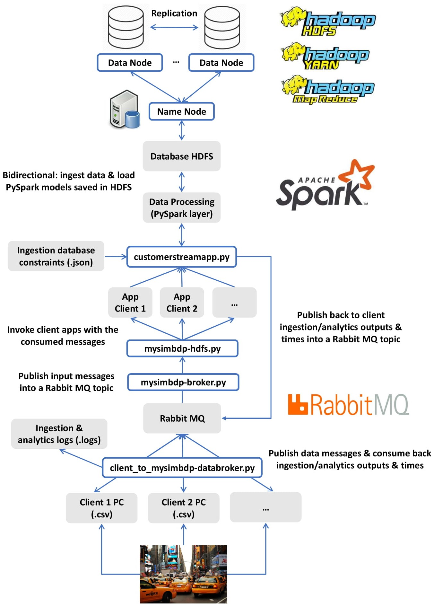
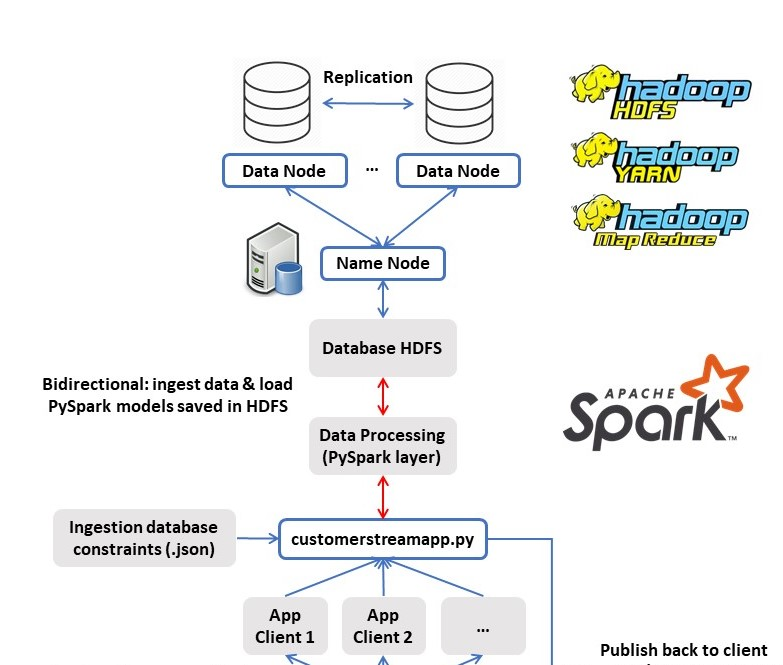
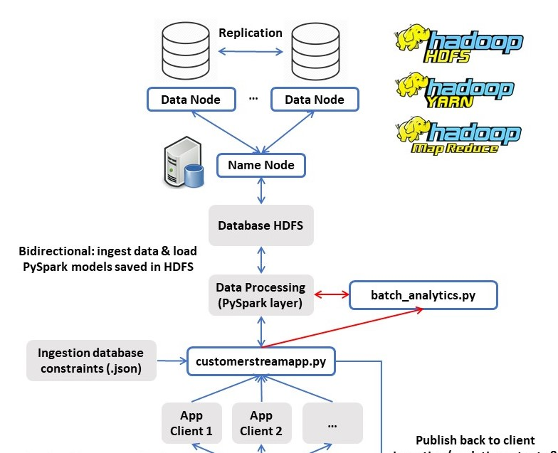

# Part 1 - Design for streaming analytics

### 1. Select a dataset suitable for streaming analytics for a customer as a running example (thus the basic unit of the data should be a discrete record/event data). Explain the dataset and at least two different analytics for the customer: (i) a streaming analytics which analyzes streaming data from the customer (customerstreamapp) and (ii) a batch analytics which analyzes historica results outputted by the streaming analytics. The explanation should be at a high level to allow us to understand the data and possible analytics so that, later on, you can implement and use them in answering other questions.

The dataset selected for this assignment is the *2018 Yellow Taxi Trip Data*, the yellow and green taxi trip records which include fields capturing pick-up and drop-off dates/times, pick-up and drop-off locations, trip distances, itemized fares, rate types, payment types, and driver-reported passenger counts. The data was collected and provided to the NYC Taxi and Limousine Commission (TLC) by technology providers authorized under the Taxicab & Livery Passenger Enhancement Programs. It is a very big dataset with 9.71GB of data, 112,234,627 entries and 17 features: *VendorID, tpep_pickup_datetime, tpep_dropoff_datetime, passenger_count, trip_distance, RatecodeID, store_and_fwd_flag, PULocationID, DOLocationID, payment_type, fare_amount, extra, mta_tax, tip_amount, tolls_amount, improvement_surcharge, total_amount*. You can find more details in the metadata file *data/data_dictionary_trip_records_yellow.pdf*. This data is suitable for streaming analytics since the basic unit of the data is single events or records registered through time.

i) One possible streaming analytics application is the one developed in my implementation of *customerstreamapp*. Firstly, I have used the historical dataset to train two Machine Learning models that predict the feature *total amount*: a Linear Regression and a Gradient Boosted Trees Regressor. I have done this storing the dataset into *Hadoop HDFS* in my *GCP Dataproc Cluster* and using *PySpark* for preprocessing the data, training the models, and saving into *Hadoop HDFS*. Secondly, in the streaming message phase I load these models and use them to predict each new message request on the fly. This is useful since it enables the clients to know if, for example, they are being overcharged.

ii) One possible batch analytics application which analyzes historical data from the streaming analytics would be to calculate statistics, such as the total amount charged or the amount of the tips, by the feature *PULocationID* which is the TLC taxi zone in which the taximeter was engaged. This could be done repeatedly through time windows and would be very helpful to know which are the zones with mode demand of taxis or the zones where higher tips are given to the drivers.

### 2. Customers will send data through message brokers/messaging systems which become data stream sources. Discuss and explain the following aspects for the streaming analytics: (i) should the analytics handle keyed or non-keyed data streams for the customer data, and (ii) which types of delivery guarantees should be suitable.

i) In streaming analytics is more convenient to handle keyed data streams since it avoids issues like the order of data values and it is more flexible. A problem with this option is the extra space taken to send each message due to the fact that the keys of values and the character used to add extra bytes to the message. For example, in my implementation I use a JSON schema for the message which is a standard that allows data to be checked with a variety of tools before it is even imported into the database. The JSON documents stored in the database can have varying sets of fields with different types for each field, and you can define the data type of each property and how it should be validated to check for the range of values.

*ii)* Firstly, the type of delivery guarantees or checks that are needed are, for example, features values format/type, all database columns/features are included in the message, range of values, etc. In my implementation, the *code/customerstreamapp.py* includes a format check function called for each consumed message before ingestion and doing analytics which contains all these mentioned things by using the constraints from the file *code/config_ingestion_constraints.json*. Secondly, there are also guarantees provided by the message broker system used, in my case *Rabbit MQ*. From the documentation of the official web page, I read that this tool ensures data safety on the consumer side. It means that in case of network failure (or node failure), messages can be redelivered, and consumers must be prepared to handle deliveries they have seen in the past. If a message is delivered to a consumer and then queued again, either automatically by RabbitMQ or by the same or different consumer, RabbitMQ will set the redelivered flag on it when it is delivered again. This is a hint that a consumer may have seen this message before but this is not guaranteed as the original delivery might have not made it to any consumers due to a network or consumer application failure. If the redelivered flag is not set then it is guaranteed that the message has not been seen before. Therefore if a consumer finds it more expensive to deduplicate messages or process them in an idempotent manner, it can do this only for messages with the redelivered flag set.

### 3. Given streaming data from the customer (selected before). Explain the following issues: (i) which types of time should be associated with stream sources for the analytics and be considered in stream processing (if the data sources have no timestamps associated with events, then what would be your solution), and (ii) which types of windows should be developed for the analytics (if no window, then why). Explain these aspects and give examples.

i)  The stream sources can have several types of time associated with it. Mainly, it can contain time information as a data feature due to the problem in question or it can have associated a sending time to track the performance metrics associated with it. In my selected dataset *2018 Yellow Taxi Trip Data*, each event has some times intrinsically associated with it, for example, the features *tpep_pickup_datetime* and *tpep_dropoff_datetime*. However, since I wanted to properly track the stream data source and my platform performance I added the sending time at the moment of connecting to message broker due to the fact the maybe the data is sent with delay and the time features could not be a good reference (obviously at least not a good reference in my implementation since I am using a past dataset).

*ii)* This question is interesting but very open since it depends on the type of analytics that one wants to develop. On the one side, it can happen that no window is applied due to the fact that you are only giving, for example, a predicted value for each message on the fly and that is all. An example of this could be the case of an online bank which borrows money to people and when customers fill out the information in the website the company needs to give instantaneously a pre-acceptation to filter bad candidates and avoid having too high workload revising the document of bad candidates. On the other side, very different analytics can be developed including more than one message but pretty much on the fly since the window can be small. For example in my dataset, it could be interesting to have windows of 5 minutes and compute statistics about the actual taxi situation at this moment, for example, the demand or total money charged grouping by areas with features such as *PULocationID*.

### 4. Explain which performance metrics would be important for streaming analytics for your customer cases.

In the defined structure of the streaming analytics platform, the main metrics that are important to measure are: the time needed to send the message to the message broker server from the client-side, the time taken to ingest this data to the database once it is in the server, and the time taken for the analytics to be applied to this message or the stream of messages. For example, in my implementation: the script *code/client_to_mysimbdp-databroker.py* provides the total time taken to send all the specified messages to the broker (which does not mean that the messages are ingested to the database already, but the client is free and the message broker will handle it), the *code/customerstreamapp.py* calculates and sends back to the customer the ingestion time taken, from the moment that the message is processed from the queue of the message broker in the server, as well as the time taken for running only the analytics part with this data message (which will be explained more detailedly later).

Note that compared to previous assignment 1, by using a proper message broker (as in assignment 2) we make the client-side work to send the messages very smooth and fast since now he does not have to wait until the ingestion is done. However, respect to assignment 2, now we are adding the analytics part and depending on the complexity of it and the tool used it can be more or less efficient. It is very important to think in the production phase when implementing it since many applications require almost instantaneous answers. In my implementation I used *Spark*, and the way I coded was efficient since, for example, the customer app loads in memory the Machine Learning models previously trained and only predicts on the fly the new data messages if format constraints are correct.

Finally, another type of useful metrics could be to consider the analytics predictive performance or accuracy in case it can be measured (maybe even after the streaming process like a batch analytics check).

### 5. Provide design of your architecture for the streaming analytics service in which you clarify: customer data sources, mysimbdp message brokers, mysimbdp streaming computing service, customer streaming analytics app, mysimbdp-coredms, and other components, if needed. Explain your choices of technologies for implementing your design and reusability of existing assignment works. Note that the result from customerstreamapp will be sent back to the customer in near real-time.

The following diagram shows the architecture of the design of my streaming Big Data platform. This is the description and function of each main component:
    
  - *Client PC*: This component represents the external clients, consumers or users that want to connect to the server for storing messages from their own machine at any time but also receiving analytics outputs. Then, the message broker server and database have to be available and running on the cloud to maintain access for the users. In this assignment, as you can see in the code, I have simulated different clients or concurrent requests to the platform, including both ingestion and analytics, by using multiple threads option in Python. Note that the default format in my implementation is *.csv* but it could be easily changed.
    
  - *Rabbit MQ*: This component is the message broker running on a *GCP VM* and built-in Python which defines a set of topics that can be accessed as APIs on a remote server. This component connects the customer message requests to the following component *App Client* and also connects it back to the customer for informing about the analytics and results.
  
  - *App Client*: Component running in the *GCP Dataproc Cluster* that consumes the messages from the *Rabbit MQ* component and take the customer's message received from the message broker, check if the format is correct, perform the stream analytics (prediction of *total_amount* with *PySpark* Machine Learning models), ingest to *Hadoop HDFS* database, and report the ingestion and prediction time as well as the predictions back to *Rabbit MQ* for clients to consume it.

  - *Data Processing*: This component built with Python *PySpark* contains tools for interacting with the HDFS database from Python (not only for storing or reading data but also for loading saved Machine Learning models). It works as the final ingestion component of the database and it checks the message format before ingestion and performing analytics.
    
  - *Database HDFS*: This is the component to store and manage data *mysimbdp-coredms* and it is basically an HDFS file initialized from a *.csv* in *GCP Dataproc Cluster* available on the cloud. However, it also contains the Machine Learning models previously trained and saved for the platform with *PySpark*. More setup and implementation details on file *reports/Deployment.md*. AS you can see, my testing cluster was composed by 1 Master Machine (Name Node) and 2 workers (Data Nodes) where the data is split/stored using replications and determined block size as well as processed when *Spark* tasks are called.

The interactions between these components are developed in shell scripts in Python mainly using the modules *pika* and *pyspark*. Now I will explain the connections between the main components:

  - From *Client PC* to *Rabbit MQ*: This connection is done via the Python script files *code/client_to_mysimbdp-databroker.py* in the client-side, which requests message data for storing it into *mysimbdp-coredms* HDFS as well as to receive the streaming analytics output, and *code/mysimbdp-broker.py* in the message broker server-side which creates the topics and consumes the sent messages. 
    
  - From *Rabbit MQ* to *App Client*: This connection is done inside the Python scripts *code/mysimbdp-broker.py* which publish sent message from the client to a topic consumed by *code/mysimbdp-hdfs.py*. 
     
  - From *App Client* to *Data Processing* and *Database HDFS*: This connection enables the customer apps to store the data by directly appending to the HDFS database with *PySpark* the consumed messages in *code/mysimbdp-hdfs.py* which invokes the *code/customerstreamapp.py* with the message information. However, this connection is bidirectional due to the fact that the *Client App* loads the saved Machine Learning models in the HDFS system. Note that the customer application reads the ingestion database constraints in a JSON file for the message format check.
     
  - From *App Client* to *Client PC*: This is the connection back to the customer after the message format check, the ingestion and the analytics are done. It is implemented through a *Rabbit MQ* topic which is consumed by the customer in *code/client_to_mysimbdp-databroker.py* and published by *Client APP* in *code/customerstreamapp.py*. Note that a log file containing the ingestion and analytics outputs/times is created in the client side to store this information.
    
One note about the implementation is that for keeping the *Rabbit MQ* available and running for clients I have used as the remote server a *Google Cloud Platform Rabbit MQ Certified by Bitnami* virtual machine to run the shell script *code/mysimbdp-broker.py*. Then, for keeping the *Client App* with the streaming analytics and ingestion available for the message broker and clients I have used a *Google Cloud Platform Dataproc Cluster*. Then I can access the platform as a client from any other machine at any time.

# Part 2 - Implementation of streaming analytics

### 1. Explain the implemented structures of the input streaming data and the output result, and the data serialization/deserialization, for the streaming analytics application (customerstreamapp) for customers.

The input streaming data sent to the analytics platform starts in the client-side with a *.csv* file. Then, each row is serialized into a key-value JSON format as a message to be sent to the message broker. Once the customer application receives it (as explained before), the message content is checked to ensure that the database ingestion constraints are satisfied. After performing these checks, the JSON message is deserialized and converted to a *pandas* dataframe which is reordered to match the order of the features in the database. Then it is converted to a *pyspark* dataframe to be ingested to HDFS database as a new tuple. Now, for the streaming analytics only the model features are selected and fed into the trained Machine Learning models. The predicted values are serialized again together with the ingestion and analytics time taken since this output is sent back to the client-side which store it in a log file.

### 2. Explain the key logic of functions for processing events/records in customerstreamapp in your implementation.

As you can see in my implementation *code/customerstreamapp.py*, there are 4 main functions which are called from *code/mysimbdp-hdfs.py* which invokes the customer app of each client with the consumed messages from the broker. Firstly, the function *init_spark* is called once for each open application to set up the *Spark* session context with the determined number of executor cores for *YARN*. Secondly, the function *init_analytics_output_RabbitMQ_topic* is called once for each open application to declare the *Rabbit MQ* channel for sending back to the customer the explained information. Thirdly, the function *check_ingestion_constraints* is called for each message and returns the constraints check result by using *code/config_constraints.json*. Lastly, the function *ingest_and_run_analytics* is called for each message to do the steps explained in previous question 2.1.

### 3. Run customerstreamapp and show the operation of the customerstreamapp with your test environments. Explain the test environments. Discuss the analytics and its performance observations.

For answering this question I run my test running *code/client_to_mysimbdp-databroker.py* with the subsample data provided *data/2018_Yellow_Taxi_Trip_Data_sample.csv* and its output is shown in *logs/analytics_output.log*. Basically, as you can see, it contains the result for each send message including format constraints check, the ingestion time (from the moment of reception in the app to the end of ingestion including the format constraints checks), the analytics time (only including the model features selection and the prediction by the two models), the predicted value with the Linear Regression, the predicted value with the Gradient Boosted Trees Regressor models, and the true target value to compare it. Going through this file, we can observe that the ingestion time is pretty much constant around 0.3 seconds and the analytics time ranges from 0.5 to 1 second with a mean value around 0.6. Note that these times are not fairly comparable with my previous assignments due to different factors: now these times include extra computations for the explained steps apart from the pure ingestion itself; the database is *Hadoop HDFS* based instead of *Mongo DB*; and the data processing is based on *PySpark* which can have different performance and protocols compared to PyMongo for example. Moreover, I want to comment that when running *code/client_to_mysimbdp-databroker.py*, on the client side all data (300 message or *.csv* rows in the sample) are ingested in 6.5 seconds which gives an average of 0.02 seconds for message, which is way faster than ingestion times in previous assignments without a proper message broker and clients had to wait until a message was processed to send the next one. This is just the time to send the message to the broker without ingesting or doing analytics but it is very important since after that the client is free and does not need to wait. That is one of the main points of using message brokers such as *Rabbit MQ*.

On the other side, I would like to comment on the analytics performance in terms of predictive model capabilities and data analysis done before training the models. In the Jupyter Notebook file *code/training-PySpark-ML-models.ipynb* you can find the Machine Learning pipeline followed using *PySpark*, which includes: basic statistics of features, features correlation with the target, feature selection, train/test split, training of Linear Regression and GBT Regressor, model coefficients or features importance, validation using metrics *R squared* and *RMSE* metrics, and finally model saving to *Hadoop HDFS*. In this script you can find the validation performance on test observations, and the model is performing pretty well achieving high values for the metrics selected. Now, it is a predictive performance estimation for new streaming message requests.

### 4. Present your tests and explain them for the situation in which wrong data is sent from or is within data sources. Report how your implementation deals with that (e.g., exceptions, failures, and decreasing performance). You should test with different error rates.

For answering this question I will firstly explain the content of the file *code/config_constraints.json*. As you can see it basically contains for each feature the correct or permitted type, the maximum and minimum values in case of restriction needed. I have set this configuration based on the exploratory data analysis in *code/training-PySpark-ML-models.ipynb*.

    {"client1":{"VendorID":{"type":"int","min":1,"max":4},
                "tpep_pickup_datetime":{"type":["unicode","str"]},
                "tpep_dropoff_datetime":{"type":["unicode","str"]},
                "store_and_fwd_flag":{"type":["unicode","str"]},
                "PULocationID":{"type":"int","min":1,"max":265},
                "DOLocationID":{"type":"int","min":1,"max":265},
                "total_amount":{"type":["int","float"],"min":1},
                "passenger_count":{"type":"int","min":0},
                "trip_distance":{"type":["int","float"],"min":0},
                "extra":{"type":["int","float"]},
                "mta_tax":{"type":["int","float"]},
                "tip_amount":{"type":["int","float"]},
                "tolls_amount":{"type":["int","float"]},
                "improvement_surcharge":{"type":["int","float"],"min":0},
                "fare_amount":{"type":["int","float"],"min":0},
                "RatecodeID":{"type":"int","min":1,"max":99},
                "payment_type":{"type":"int","min":1,"max":5}
               }
    }

Then, the situation in which wrong data is sent is handled in *code/customerstreamapp.py* which loads this the constraints file to check that each requested message is correct with the function *check_ingestion_constraints*. As you can see in the implemented functions, when *ingest_and_run_analytics* function is called, if the format check report is not "OK" then the ingestion and analytics are not applied and the output report sent back to the customer is simply the format check error which I have implemented to be informative and specific for each error. Although in the provided log file all messages have correct format, I have also tested it with files including correct and wrong message and my implementation works fine getting informative output reports in the client-side.

### 5. Explain parallelism settings in your implementation and test with different (higher) degrees of parallelism. Report the performance and issues you have observed in your testing environments.

This question is very important for understanding well how *Spark* works internally. In the *code/customerstreamapp.py* inside the function *init_spark* you can find the following *Spark* context initialization code:
    
    spark.sparkContext._conf.set('spark.executor.cores', spark_executor_cores)

When invoking new customer apps with *code/mysimbdp-hdfs.py*, the argument *--spark_executor_cores* define the number of executor cores for *YARN* that we want to use. This defines the main parallelism settings of our streaming analytics platform since by changing this parameter we would scale the processing power and capability of our system. Of course this is constrained to the number of machines and cores selected during the cluster creation process. I tested it setting it from 1 to 4 (maximum number of cores in my simple *GCP Dataproc* cluster) and the performance is improved by *Spark* parallelism especially when training the Machine Learning models which is a heavier task than just predicting or ingesting one single row or observation or message.

# Part 3 - Connection

### 1. If you would like the analytics results to be stored also into mysimbdp-coredms as the final sink, how would you modify the design and implement this (better to use a figure to explain your design).

The following figure zooms the previous plot for my architecture and marks in red colour where the implementation changes would be done. As you can see, previously the connection between *App Client* to *Data Processing* and *Database HDFS* was already bidirectional due to the fact that the *Client App* ingested the message data into the database and loaded the saved Machine Learning models in the HDFS system to predict it and give back the output to the customer. However, now apart from storing only the message data it would also ingest the analytics results (same than the ones reported to the customer for example). We could store it in the same database by adding features/columns for these new keys or features, or we could have another database to store separately the analytics corresponding to each message ingested in the previous database.

### 2. Given the output of streaming analytics stored in mysimbdp-coredms for a long time. Explain batch analytics (see also Part 1, question 1) that could be used to analyze such historical data. How would you implement it?

As I mentioned in previous question 1.1, one possible batch analytics application which analyzes historical data from the streaming analytics would be to calculate statistics, such as the total amount charged or the amount of the tips, by the feature *PULocationID* which is the TLC taxi zone in which the taximeter was engaged. This could be done repeatedly through time windows and would be very helpful to know which are the zones with mode demand of taxis or the zones where higher tips are given to the drivers.

Now I will explain how I would implement this example. First of all, I would add a Python script in the *GCP Platform Cluster* that uses *PySpark* such as *code/customerstreamapp.py* but for the batch analytics. Basically, it would get as input customer messages data previously stored in the database via the streaming platform and run the computations mentioned by calling *PySpark* functions such as SQL commands with GroupBy, etc. Now, it would depend on the needs but we could store this batch analytics results in another HDFS database. Finally, I would run this script automatically every some period of time, like every hour or whatever desired time.

### 3. Assume that the streaming analytics detects a critical condition (e.g., a very high rate of alerts) that should trigger the execution of batch analytics to analyze historical data. How would you extend your architecture in Part 1 to support this (use a figure to explain your work)?.

The following figure zooms the previous plot for my architecture and marks in red colour where the implementation changes would be done. As you can see, I added the *batch_analytics.py* script mentioned in the previous question and connect it bi-directionally to the *Data Processing* and *Database HDFS* component. Moreover, you can see the arrow added from *code/customerstreamapp.py* to *batch_analytics.py* which basically means that it will be calling (or sending a status of critical condition detected) the batch analytics app for running it not only in the established times but also every time a critical condition is found in the streaming analytics app.

### 4. If you want to scale your streaming analytics service for many customers and data, which components would you focus and which techniques you want to use?

For scaling my streaming analytics platform for many customers and data, the main components I would focus on would be:

  - the number of processors and cores for letting *Apache Spark* to process all the ingestion and analytics requests faster by increasing the previously explained parameter *spark.executor.cores* which affects the number of executor cores for *YARN*,

  - the number of processors and cores for the message broker *Rabbit MQ* since it will be needed when opening more channel topics when the rate of message received per second increases and we have to set up some parallelization,
  
  - trying another message broker more compatible with *Apache Spark* as for example *Apache Kafka* which would enable us to speed up the whole pipeline end-to-end and increase the scalability our service,
  
  - trying another database could be selected for getting higher efficiency when ingesting each message since the choice of the *HDFS* as the database in this assignment may not be the more efficient method as final sink after the streaming analytics.

### 5. Is it possible to achieve end-to-end exactly-once delivery in your current implementation? If yes, explain why. If not, what could be conditions and changes to make it happen? If it is impossible to have end-to-end exactly-once delivery in your view, explain why.

By using *Rabbit MQ* as a message broker and *Hadoop Spark* for the streaming analytics it is hard to achieve end-to-end exactly-once delivery in my architecture implementation. Then my answer is that since this product or tools are from different providers/companies then there is not straight forward to implement it. Then, I will explain the conditions and changes to implement it in one of the possible ways. First of all, since I am using *Apache Hadoop* and *Apache Spark*, a smart choice as message broker would be *Apache Kafka* due to feature compatibility. Using it in this architecture, one possibility to achieve end-to-end delivery would be to use a specific session configuration parameter in producer side for setting up acknowledgements and ensuring reliability when sending the message through *Apache Kafka*. This option ensures that a message is sent perfectly until the end of the analytics pipeline since it sends back an acknowledgement when the broker receives the message and also when *Apache Spark* has done the analytics. However, the customer or producer has to handle this, for example, to take the action of retrying it or not in case that the acknowledgement was negative.